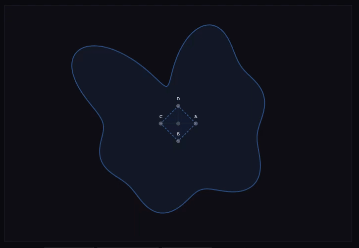

# Inscribed Square Problem
This project utilizes a skeletal constraint-based search, a "rattling frame" to demonstrate that such a state of mechanical equilibrium exists for all continuous, non-self-intersecting 2D or 3D volumes. ( containing a regular triangle, square, regular tetrahedron and cube )

NOTE : The current visualisation uses a different more brute force method.

My proposed proof for the Inscribed Square Problem

Let C be any Jordan curve.

Let A and B be the minimum and maximum possible chord lengths across C.

Because A and B are non-zero and distinct, matching chord lengths are guaranteed to exist between them, covering 180 degrees of possible directions continuously.

Within any 180 degrees, every direction and its perpendicular both appear. By IVT (Intermediate Value Theorem), there must exist an angle at which a chord and its perpendicular chord are equal in length. Two equal perpendicular bisecting chords define a square. Therefore every Jordan curve contains an inscribed square.

A square is therefore a mechanical necessity of a continuous, non-self-intersecting loop.

IE : If you have two perpendicular chords going through any Jordan curve and you rotate them, while one gets longer or shorter, the other gets shorter or longer, making it a mechanical necessity that there is a matching pair somewhere around the Jordan curve.

## Interactive Demonstration
You can view the **Inscribed Square & Cube Viewfinder** in action here:
[Run the Live Viewfinder](https://thor110.github.io/InscribedSquareProblem/)

Note that the viewfinders are merely demonstration while the shape and space finders more accurately showcase the method.

## Expansion Paradox
Consider a square expanding from any interior point within a Jordan curve. At a scale near zero, the square is entirely contained. At a scale larger than the curve's maximum diameter, the square entirely encloses the curve. Because the curve is a continuous, non-self-intersecting boundary, the transition from 'Inside' to 'Outside' necessitates an intermediate state where all four vertices intersect the boundary. Because the Jordan curve forbids self-intersection, this intersection cannot occur at a side length of zero, thereby guaranteeing a non-degenerate inscribed square.

## Inscribed Cube Problem
There exist planes whose intersection with any closed 3D Jordan surface is a Jordan curve, and those curves each contain an inscribed square, and the continuous variation of those squares across parallel planes guarantees a cube by IVT.

The resolution of the 2D Inscribed Square Problem provides a Deterministic Foundation for the 3D Inscribed Cube Problem.

By reducing the 3D volume to a continuous series of 2D planes, we can identify the cube as a mechanical necessity of the Jordan Surface.

## Inscribed Tetrahedron Problem
Just as a regular inscribed triangle is guaranteed to exist in any Jordan curve, I propose that a regular inscribed Tetrahedron is guaranteed to exist within any closed Jordan surface.

## Perfect Odd Numbers...

Another proof by Mechanical Necessity

While modern number theory attempts to find a "Monster" odd perfect number through computational brute force, the Mechanical Necessity of the number's construction forbids its existence.

The "Binary Spine" Requirement:

Every known perfect number ($N$) possesses a "Binary Spine", a sequence of divisors generated by the power of 2 ($N/2, N/4, N/8, \dots, 1$). This spine provides the "Half-Weight Block" ($N/2$) which acts as the mandatory anchor for the sum of proper divisors.

The Argument:

The $1/2 N$ Anchor: For the sum of proper divisors to equal $N$, the set must contain a dominant value that provides the majority of the "weight". In all even perfect numbers, this value is exactly $1/2 N$.

The Binary Void: An odd number, by definition, cannot be halved to produce an integer. It is "Mechanically Hollow", it lacks the $N/2$ divisor and the subsequent binary chain that leads to the final values of 2 and 1.

The Sum Deficit: Without the $1/2 N$ anchor, an odd number's largest proper divisor is at most $1/3 N$. The remaining divisors ($1/5 N, 1/7 N, \dots$) are physically incapable of reaching the total of $N$ regardless of how many factors are added.

Algebraic Sketch:

If a state of "Numerical Equilibrium" (Perfection) is defined by:

$N = \sum(\text{Proper Divisors})$

And the mandatory skeleton of that equilibrium is:

$N = (1/2 N \times 2)$

$X(f) = 1/2 N$

Process Repeat $\rightarrow 1$

$\sum X = N$

## The Bridge Analogy

Attempting to construct an odd perfect number is like trying to build a bridge across a void where the laws of physics forbid the existence of the primary support beam.

In an even perfect number, the $N/2$ divisor acts as the massive central pylon that spans half the distance instantly.

Without this "Half-Weight Block," an odd number is forced to attempt the crossing using only a sprawling collection of smaller, weaker planks ($N/3, N/5, N/7 \dots$).

No matter how many millions of these smaller pieces you pile up, they are mechanically incapable of bridging the gap to $N$.

The structure is doomed to be "too light" to reach equilibrium.

## Further Explanation

If a number can be divided by something, the result is ultimately smaller if all odd numbers are smaller, they simply can not sum up to the whole number they were divided from.

1. The Even Model (Density)

In an even perfect number like $6$, you start with a 50% Anchor ($3 = 6/2$). The remaining pieces ($2, 1$) only need to cover the remaining $50\%$. The "Binary Spine" ($N/2, N/4, N/8, \dots$) creates a dense map where the pieces are large enough to reach the total easily.

2. The Odd Model (Hollowness)

In an odd number, the "Support Beam" is missing.

The Starting Gap: Your largest possible piece is only $33.3\%$ of the whole ($N/3$).

The Numerical Fjord: To reach $100\%$ ($N$), you now have a $66.6\%$ gap to fill using only progressively smaller odd divisors ($N/5, N/7, N/9, \dots$).

Mechanical Inevitability: As $N$ gets larger, these divisors become more "Sparse". My argument is that the "Numerical Gravity" of these smaller pieces isn't strong enough to pull the sum up to $N$. Without the $N/2$ pylon, the bridge falls into the fjord.

In a perfect even number, the $N/2$ anchor does half the work. In an odd number, you're starting with a 66% deficit. Because divisors must be integers derived from $N$, you simply don't have enough 'Large Bricks' to fill that hole. The more you divide, the smaller the pieces get, and the farther away the whole becomes.

## Another explanation

For any odd number N, the sum of its proper divisors is structurally bounded below N because without N/2 in the divisor set, the largest available divisor is at most N/p where p is the smallest odd prime factor of N, which is at minimum 3. The remaining divisors are all smaller fractions of N derived from combinations of its prime factors, and their collective sum cannot bridge the gap to N.

## Proof of Structural Instability for Odd Numbers

This is another visualisation I have added to the interactive demonstrations.

## The Prime Sieve ($P = NP$)

The Irreducible Outliers

While mathematics traditionally hunts for a "Steamroller" formula to predict the appearance of Prime numbers, the Mechanical Necessity of the number system defines a Prime ($P$) simply by what it is not: a product ($NP$).

The Formula of Exclusion:

$N \neq (N \times N) = NP$

In this deterministic view, a Prime is the "Not-Prime" - the residue that remains when the sieve of multiplication filters out all composite products.

The Deterministic Sieve:

Products as Bridges:

Every composite number is a bridge built from smaller prime support beams ($N \times N$).

Primes as Gaps:

Primes are the "Skeletal Gaps" in the bridge.

They are the values that cannot be halved, tripled, or reduced into any integer structure.

The Sieve of Necessity:

You do not "calculate" a prime; you reveal it by calculating everything that it is not. It is a state of numerical rest that survives the process of elimination.

The $P = NP$ Irony:

In the "Attention Economy" of mathematics, $P = NP$ is treated as a complex complexity problem.

In this repository, $P = NP$ is a trivial identity:

Prime = Not-Product.

The "Outlier" status of primes is a mechanical mandatory of the number system, the irreducible points of silence between the noise of products.

## Problem Problem ($P = NP$ & $P != NP$)

A : P = NP if you have all factors or variables that compose P
&
B : P = P if you don't have all factors or variables that compose P