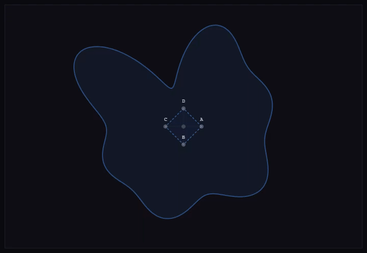
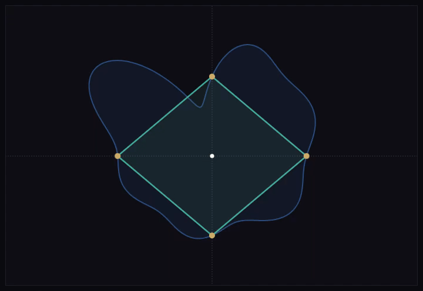
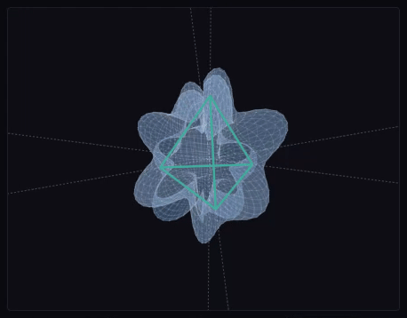

# Inscribed Problems
This project utilizes a skeletal constraint-based search, a "rattling frame" to demonstrate that such a state of mechanical equilibrium exists for all continuous, non-self-intersecting 2D or 3D volumes. ( containing a regular triangle, square, regular tetrahedron and cube )

This repository also contains some other proposed proofs of mine.

## Interactive Demonstration
You can view the **Inscribed Square & Cube Viewfinder** in action here:
[Run the Live Viewfinder](https://thor110.github.io/InscribedSquareProblem/)

Note that the viewfinders are merely demonstration while the skeletal finders more accurately showcase the method.

## Inscribed Triangle Problem

This problem is already solved by the authors of this paper : https://www.researchgate.net/publication/349125923_Inscribed_triangles_of_Jordan_curves_in_mathbbRn

I have presented a demonstration using my method anyway which can be seen here.

[Run the Skeletal Shape Finder](https://thor110.github.io/InscribedSquareProblem/pages/skeletal-shapefinder.html?shape=triangle)

## Inscribed Square Problem
My proposed proof for the Inscribed Square Problem

**The Skeletal Frame:** Let $C$ be any Jordan curve.

Define a 'Skeletal Jig' consisting of two perpendicular lines intersecting at a common midpoint $I$.

**The Points of Intersection:** As $I$ moves within $C$ and the jig rotates ($\theta$), the lines intersect $C$ at four points ($E, F, G, H$), forming two perpendicular chords.

**The Continuity of Chords:** Because $C$ is a continuous Jordan curve, the lengths of these chords and their distances from $I$ vary continuously with respect to $I(x, y)$ and $\theta$.

**The First Equilibrium (Length):** At any fixed point $I$, rotating the jig $90^\circ$ swaps the two chords. If Chord 1 was longer than Chord 2, it is now shorter. By the Intermediate Value Theorem (IVT), there must exist an angle $\theta$ where the two perpendicular chords are equal in length.

**The Second Equilibrium (Bisection):** As $I$ is moved through the interior of $C$, the offset of these equal-length chords (the distance from $I$ to the boundary) also varies continuously. There exists a position for $I$ where the midpoint of the jig aligns with the midpoints of both chords.

**The Result:** When the chords are perpendicular, equal in length, and bisected at $I$, the vertices $E, F, G, H$ define an inscribed square.

Therefore every Jordan curve contains an inscribed square.

A square is therefore a mechanical necessity of a continuous, non-self-intersecting loop.

[Run the Skeletal Shape Finder](https://thor110.github.io/InscribedSquareProblem/pages/skeletal-shapefinder.html)

## Inscribed Cube Problem
The resolution of the 2D Inscribed Square Problem provides a Deterministic Foundation for the 3D Inscribed Cube Problem.

**The 3D Skeletal Jig:** Let $C$ be any closed 3D Jordan surface.

Define a 3D "Skeletal Jig" representing the four internal diagonals of a cube. These four lines intersect at a common midpoint I and provide eight points of intersection with the surface C.

**The Points of Intersection:** As $I$ moves within $C$ and the jig rotates, the four diagonals intersect $C$ at eight points, forming four diagonal chords.

**The First Equilibrium (Length):** At any fixed point $I$, rotating the jig allows the diagonals to swap positions. Because the lengths of the chords vary continuously as they rotate, the Intermediate Value Theorem (IVT) guarantees an orientation where all four diagonal chords are equal in length.

**The Second Equilibrium (Bisection):** As $I$ is moved through the 3D interior of $C$, the offset of these equal-length chords (the distance from $I$ to the boundary) varies continuously. There exists a position for $I$ where the midpoint of the jig aligns with the midpoints of the four equal-length chords.

**The Result:** When the four chords are equal in length, and bisected at $I$, the eight points of intersection define the vertices of an inscribed cube.

Therefore every Jordan surface contains an inscribed cube.

[Run the Skeletal Space Finder](https://thor110.github.io/InscribedSquareProblem/pages/skeletal-spacefinder.html)

## Inscribed Tetrahedron Problem
Similarly the 2D Inscribed Triangle Problem which is already solved provides a Deterministic Foundation for the 3D Inscribed Regular Tetrahedron Problem.

**The Tetrahedral Jig:** Let $C$ be any closed 3D Jordan surface.

Define a 'Skeletal Jig' consisting of four rays extending from a common midpoint $I$ at the fixed tetrahedral angle of approximately $109.5^\circ$ from one another.

**The Points of Intersection:** As $I$ moves within $C$ and the jig rotates, the four rays intersect $C$ at four points ($E, F, G, H$).

**The First Equilibrium (Length):** Because the surface $C$ is continuous, the distances from $I$ to the four intersection points ($E, F, G, H$) vary continuously. By rotating the jig, the rays swap orientations. The Intermediate Value Theorem (IVT) guarantees that there exists an orientation and a position for $I$ where the distances from the midpoint to all four boundary points are equal.

**The Second Equilibrium:** Since the "Skeletal Jig" is composed of four axes passing through $I$, there are actually eight potential intersection points with $C$. This provides "twice the leverage," ensuring that even in highly irregular surfaces, the jig has multiple rotational paths to find a state where the primary four rays reach a length equilibrium.

**The Result:** When four points on a continuous surface are equidistant from a common center $I$ and maintained at regular tetrahedral angles, those points ($E, F, G, H$) define an inscribed regular tetrahedron.

Therefore every Jordan surface contains an inscribed regular tetrahedron.

[Run the Skeletal Space Finder](https://thor110.github.io/InscribedSquareProblem/pages/skeletal-spacefinder.html?shape=tetrahedron)

## Degrees Of Freedom

A formal explanation describing another method of reasoning as to why this is true.

To guarantee an equilibrium state, the available Degrees of Freedom (DoF) must meet or exceed the number of equality constraints required to make the shape regular.

**2D Space** (3 DoF: $X, Y, \theta$)

**Inscribed Square:** Uses 2 DoF to center the midpoint $I(x,y)$ (Bisection) and 1 DoF to rotate $\theta$ until the chords are equal.

- **Total:** 3 Constraints.

**Inscribed Triangle:** Uses 2 DoF for the midpoint and 1 DoF for rotation to equalize the 3 sides.

- **Total:** 3 Constraints.

**3D Space** (6 DoF: $X, Y, Z$ & Roll, Pitch, Yaw)

**Inscribed Cube:** Uses 3 DoF to center the midpoint $I(x,y,z)$ (Bisection) and 3 DoF of rotation to equalize the 3 perpendicular axes (6 face-centers).

- **Total:** 6 Constraints.

**Inscribed Tetrahedron:** Uses 3 DoF for the midpoint and 3 DoF for rotation to equalize the 4 rays.

- **Total:** 6 Constraints (with only 4 points of contact, this is a "Loose" mechanical certainty).

**Conclusion:** Since the available DoF ($3$ in 2D, $6$ in 3D) meets or exceeds the required points of contact, these shapes are a mechanically mandatory feature of any continuous volume.

## Expansion Paradox
Consider a regular polytope (triangle, square, tetrahedron, or cube) expanding from any interior point $I$ within a closed Jordan boundary.

At a scale near zero, the shape is entirely contained. At a scale larger than the volume's maximum diameter, the shape entirely encloses the boundary.

Because the boundary is continuous and non-self-intersecting, the transition from 'Interior' to 'Exterior' requires an intermediate state of mechanical equilibrium where all vertices (or rays) intersect the boundary simultaneously.

Because the Jordan boundary forbids self-intersection, this intersection cannot occur at a scale of zero, guaranteeing a non-degenerate inscribed shape.

## Perfect Odd Numbers...
Another proof by Mechanical Necessity

While modern number theory attempts to find a "Monster" odd perfect number through computational brute force, the Mechanical Necessity of the number's construction forbids its existence.

The "Binary Spine" Requirement:

Every known perfect number ($N$) possesses a "Binary Spine", a sequence of divisors generated by the power of 2 ($N/2, N/4, N/8, \dots, 1$). This spine provides the "Half-Weight Block" ($N/2$) which acts as the mandatory anchor for the sum of proper divisors.

The Argument:

The $1/2 N$ Anchor: For the sum of proper divisors to equal $N$, the set must contain a dominant value that provides the majority of the "weight". In all even perfect numbers, this value is exactly $1/2 N$.

The Binary Void: An odd number, by definition, cannot be halved to produce an integer. It is "Mechanically Hollow", it lacks the $N/2$ divisor and the subsequent binary chain that leads to the final values of 2 and 1.

The Sum Deficit: Without the $1/2 N$ anchor, an odd number's largest proper divisor is at most $1/3 N$. The remaining divisors ($1/5 N, 1/7 N, \dots$) are physically incapable of reaching the total of $N$ regardless of how many factors are added.

Algebraic Sketch:

If a state of "Numerical Equilibrium" (Perfection) is defined by:

$N = \sum(\text{Proper Divisors})$

And the mandatory skeleton of that equilibrium is:

$N = (1/2 N \times 2)$

$X(f) = 1/2 N$

Process Repeat $\rightarrow 1$

$\sum X = N$

## The Bridge Analogy
Attempting to construct an odd perfect number is like trying to build a bridge across a void where the laws of physics forbid the existence of the primary support beam.

In an even perfect number, the $N/2$ divisor acts as the massive central pylon that spans half the distance instantly.

Without this "Half-Weight Block," an odd number is forced to attempt the crossing using only a sprawling collection of smaller, weaker planks ($N/3, N/5, N/7 \dots$).

No matter how many millions of these smaller pieces you pile up, they are mechanically incapable of bridging the gap to $N$.

The structure is doomed to be "too light" to reach equilibrium.

## Further Explanation
If a number can be divided by something, the result is ultimately smaller if all odd numbers are smaller, they simply can not sum up to the whole number they were divided from.

1. The Even Model (Density)

In an even perfect number like $6$, you start with a 50% Anchor ($3 = 6/2$). The remaining pieces ($2, 1$) only need to cover the remaining $50\%$. The "Binary Spine" ($N/2, N/4, N/8, \dots$) creates a dense map where the pieces are large enough to reach the total easily.

2. The Odd Model (Hollowness)

In an odd number, the "Support Beam" is missing.

The Starting Gap: Your largest possible piece is only $33.3\%$ of the whole ($N/3$).

The Numerical Fjord: To reach $100\%$ ($N$), you now have a $66.6\%$ gap to fill using only progressively smaller odd divisors ($N/5, N/7, N/9, \dots$).

Mechanical Inevitability: As $N$ gets larger, these divisors become more "Sparse". My argument is that the "Numerical Gravity" of these smaller pieces isn't strong enough to pull the sum up to $N$. Without the $N/2$ pylon, the bridge falls into the fjord.

In a perfect even number, the $N/2$ anchor does half the work. In an odd number, you're starting with a 66% deficit. Because divisors must be integers derived from $N$, you simply don't have enough 'Large Bricks' to fill that hole. The more you divide, the smaller the pieces get, and the farther away the whole becomes.

## Another explanation
For any odd number N, the sum of its proper divisors is structurally bounded below N because without N/2 in the divisor set, the largest available divisor is at most N/p where p is the smallest odd prime factor of N, which is at minimum 3. The remaining divisors are all smaller fractions of N derived from combinations of its prime factors, and their collective sum cannot bridge the gap to N.

## Proof of Structural Instability for Odd Numbers
This is another visualisation I have added to the interactive demonstrations.

[Run the Number Stability Viewer](https://thor110.github.io/InscribedSquareProblem/pages/number-stability.html)